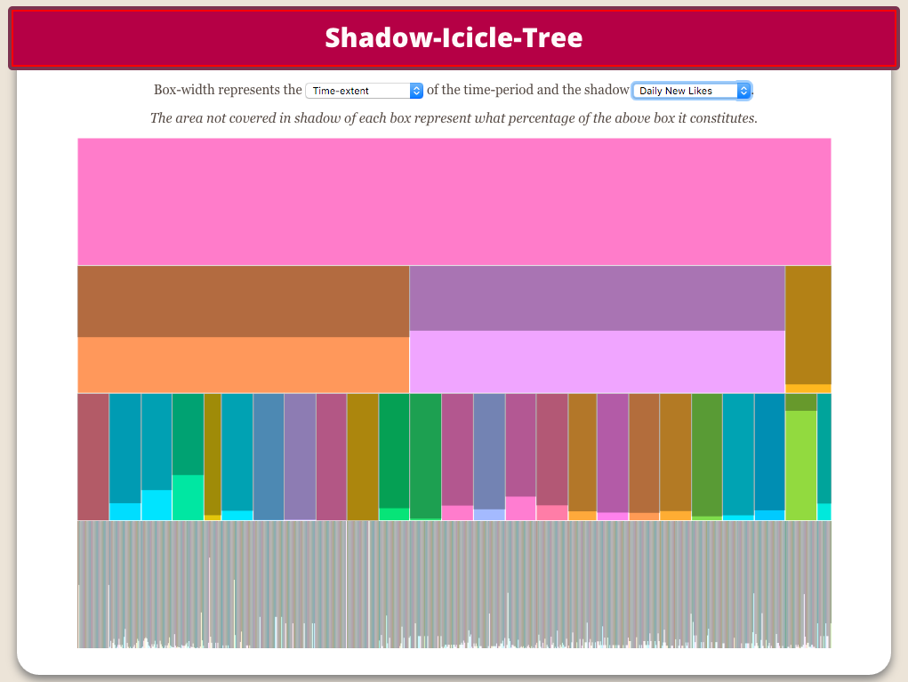
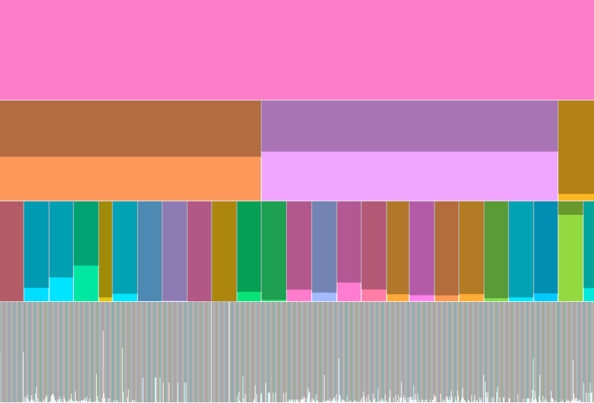
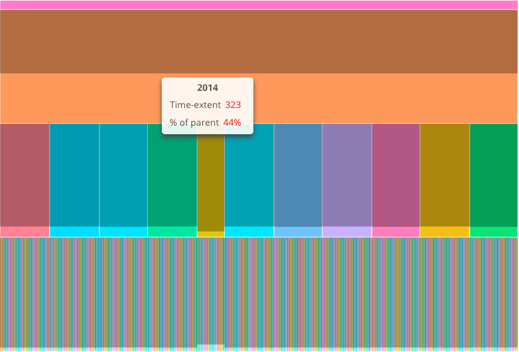
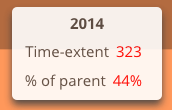

# Shadow-Icicle-Tree
### Live demo
You can check the live demo of this visualization at:
<http://rodrigoroarodriguez.github.io/shadow-icicle-tree/>

 

## Design Brief
### Problem Statement
How to represent multidimensional Facebook Insights data.

### Goal
To represent the data in a manner that combines casual information visualization and informative art. The visualization should be aesthetic enough that it could be assumed to be a work of art by a naive bystander, but at the same time clear enough so that even non-expert users can interpret it.

### Solution Analysis
The shadow-icicle-tree (my modified version of the icicle-tree), is a hierarchical visual structure that represents two arbitrary quantitative dimensions of data in the form of shaded boxes.

  
__Figure 1__: The shadow-icicle-tree visual structure.

#### Hierarchy
The icicle tree displays a hierarchy in the form of stacked rectangles. Every horizontal layer of rectangles is a level in the tree, the children being below their respective parent.

 

  
__Figure 2__: First and second levels level of the tree. The root (first level in rose pink) consists of the years 2014(orange), 2015(mauve) and 2016(yellow).

#### Width
The width of each level represent an arbitrary dimension (in this case time by default). Parents are as wide as the aggregate width of all their children (See figure 2).

#### Shadow
The shadow is used to visualize a second arbitrary dimension. The area not covered in shadow is what percentage of the parent’s value the node has. Any node with the same value as its parent will hence have no shadow. Since the root has no parent it also has no shadow (In figure 2, 2014 stands for 44% of all days, 2015 for 50% and 2016 for 6%).

#### What to visualize
As stated above, any quantitative dimensions can be used as either width or shadow values. There are two selection combo-boxes in the demo.

  
__Figure 3__: combo-boxes for selecting the represented dimensions.

### Additional Features
The Shadow-Icicle-Tree was conceived as an ambient visualization. I assumed that in the future touchscreen billboards could exist and be widely available at public spaces. Interested passersby could then touch the screen to zoom into areas of interested or reveal additional information.

#### Zooming
By clicking on a node the user will zoom on that node. The clicked node’s width will become the screens width, a little padding is left on top the clicked node so that parent node is still visible so that the user can navigate upwards in the hierarchy.

 
__Figure 4__: combo-boxes for selecting the represented dimensions.

#### Visual alerts
Both zooming and changing the visualized variables are animated.

#### Details on demand
One of the issues with information art, in my opinion, is even when the user knows it is information art they may still be unable to interpret the visualization. For this reason I though that any
By hovering over a node an informative tooltip will be displayed  showing some of the data that the node represents.

 
__Figure 5__: combo-boxes for selecting the represented dimensions.

